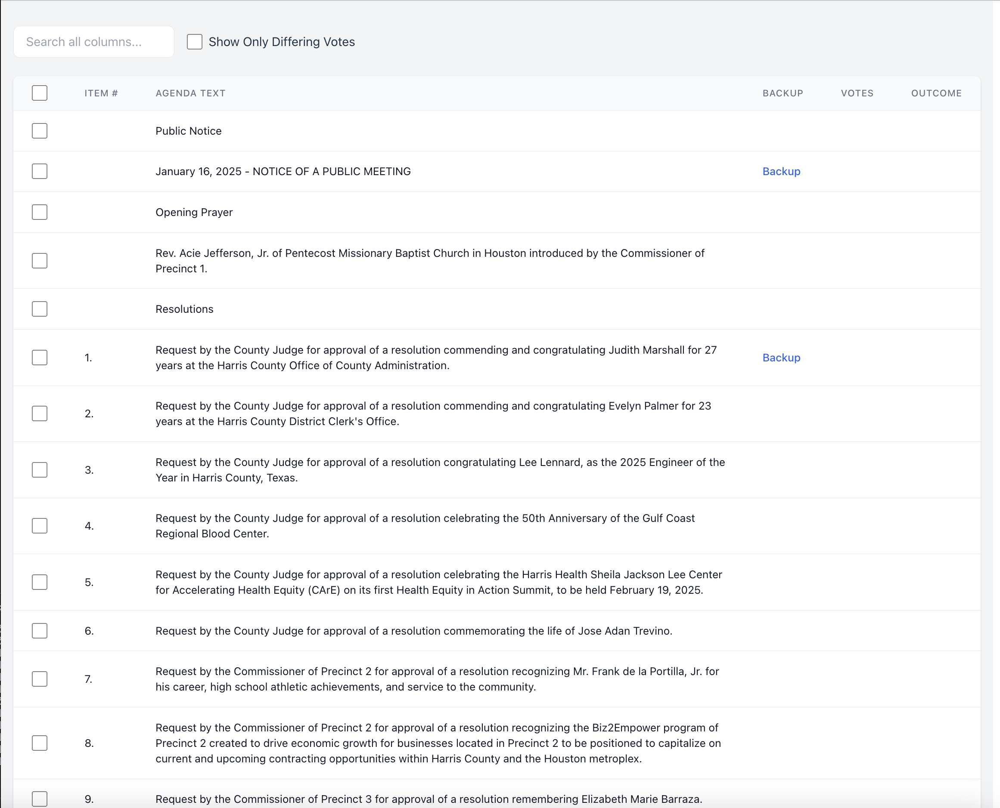
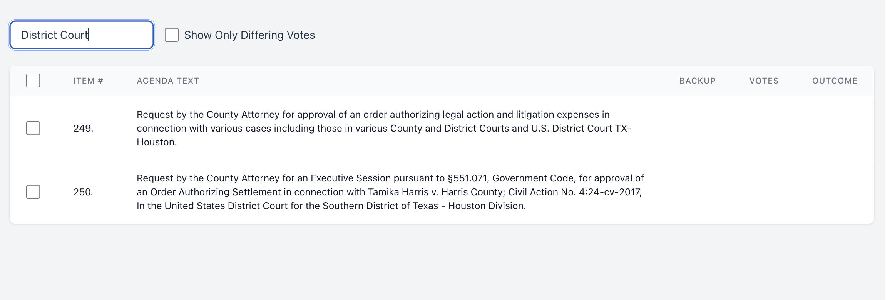

# Commissioners Court Agenda Picker (CCAP)

## Overview
The Commissioners Court Agenda Picker (CCAP) is a modern web application designed to streamline the process of managing and customizing Commissioners Court agenda items. It enables key leadership stakeholders to efficiently select and compile relevant agenda items for their organizations, transforming the way organizations interact with court proceedings.

## 📸 Screenshots

### Main Agenda View

*Interactive agenda table with filtering and selection capabilities*

### Search and Filter

*Powerful search and filtering options to find specific items*

### Generated PDF

*Clean, professional PDF output with selected items*

## 🌟 Key Features
- **Interactive Agenda Table**: Browse and select agenda items through a user-friendly interface powered by TanStack Table
- **Smart Filtering**: 
  - Global search across all columns
  - Special filter for items with differing votes
  - Checkbox-based item selection
- **Custom PDF Generation**: Generate professional PDFs with selected agenda items using @react-pdf/renderer
- **Modern UI/UX**: Clean, responsive design built with React and Tailwind CSS
- **Real-time Data Management**: Efficient data fetching and caching with TanStack Query

## 🏗️ Project Structure

```
commissioners-court/
├── client/                # Frontend application
│   ├── src/
│   │   ├── components/   # React components
│   │   ├── api/         # API integration
│   │   ├── types/       # TypeScript types
│   │   └── assets/      # Static assets
│   ├── public/          # Public assets
│   └── index.html       # Entry HTML file
├── server/               # Backend application
│   ├── src/            # Server source code
│   └── data/           # JSON data files
├── dist/                # Production build output
└── config files         # Various configuration files
```

## 🚀 Installation

### Prerequisites
- Node.js (v18 or higher)
- npm or yarn package manager

### Setup Steps
1. Clone the repository:
```bash
git clone [your-repository-url]
cd commissioners-court
```

2. Install dependencies:
```bash
npm install
```

3. Create environment file:
Create a `.env` file in the root directory with:
```
VITE_API_URL=http://localhost:3003/api
```

4. Start the development servers:
```bash
# Start both client and server in development mode
npm run dev
```

## 💻 Usage
1. Access the application at `http://localhost:5173`
2. Use the global search bar to filter agenda items
3. Toggle "Show Only Differing Votes" to focus on split decisions
4. Select items using checkboxes
5. Click "Generate Items of Interest" to create and download a custom PDF with selected items

## ⚙️ Available Scripts

- `npm run dev` - Start both client and server in development mode
- `npm run dev:client` - Start only the client development server
- `npm run dev:server` - Start only the API server
- `npm run build` - Build the production version
- `npm run build:server` - Build the server for production
- `npm run start` - Start the production server
- `npm run lint` - Run ESLint for code quality

## 🛠️ Technologies Used
- **Frontend**:
  - React 18
  - TypeScript
  - Vite
  - TanStack Table v8
  - TanStack Query v5
  - @react-pdf/renderer
  - Tailwind CSS
  - Framer Motion
- **Backend**:
  - Express.js
- **Development Tools**:
  - ESLint
  - TypeScript ESLint
  - PostCSS
  - Tailwind CSS

## 🤝 Contributing
We welcome contributions! Please see [INSTRUCTIONS.md](INSTRUCTIONS.md) for detailed development workflow guidelines.

## 📝 License
This project is licensed under the MIT License - see the [LICENSE](LICENSE) file for details.

## 🙏 Acknowledgments
- Built with modern web technologies and open-source tools
- Powered by TanStack's excellent React libraries
- Inspired by the need for efficient government proceedings management

---
Made with ❤️ for improving government transparency and efficiency
